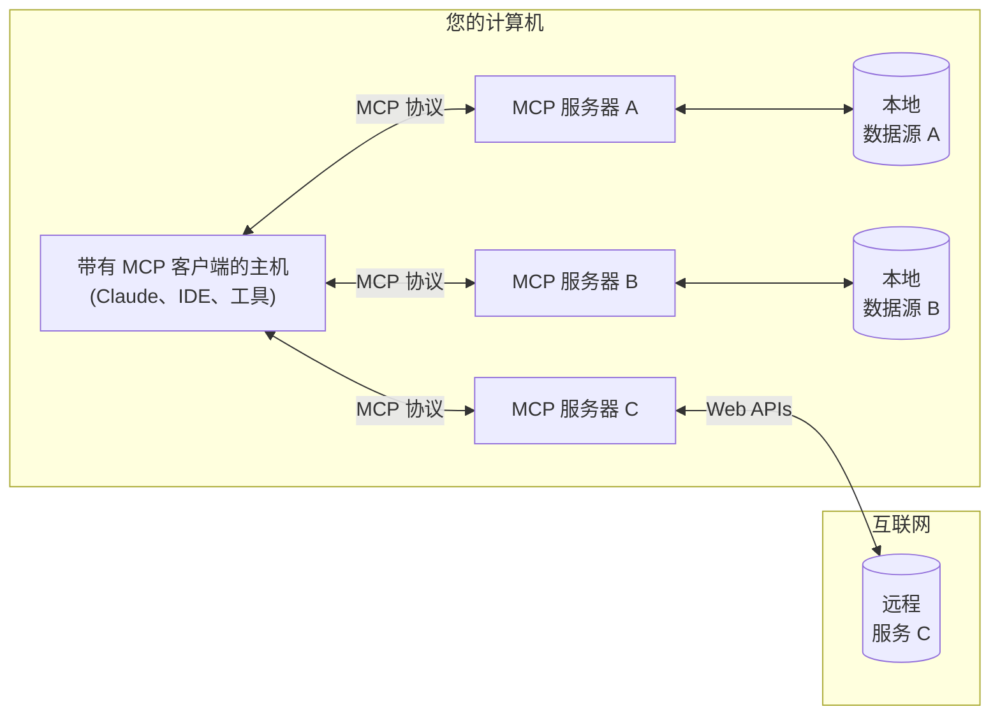

<Note>C# SDK 已发布！查看[其他新内容](/development/updates)</Note>

MCP 是一种开放协议，标准化了应用程序如何为大型语言模型（LLM）提供上下文。可以将 MCP 想象成 AI 应用的 USB-C 端口。就像 USB-C 为设备连接各种外设和配件提供了标准化方式一样，MCP 为 AI 模型连接不同的数据源和工具提供了标准化方式。

## 为什么选择 MCP？

MCP 帮助您基于大型语言模型构建代理和复杂的工作流程。大型语言模型经常需要与数据和工具集成，MCP 提供了：
- 不断增长的预构建集成列表，您的 LLM 可以直接接入
- 在 LLM 提供商和供应商之间切换的灵活性
- 在您的基础设施中保护数据的实践

### 总体架构

MCP 的核心采用客户端-服务器架构，一个主机应用程序可以连接到多个服务器：

- **MCP 主机**：如 Claude Desktop、IDE 或希望通过 MCP 访问数据的 AI 工具等程序
- **MCP 客户端**：与服务器保持 1:1 连接的协议客户端
- **MCP 服务器**：通过标准化的模型上下文协议暴露特定功能的轻量级程序
- **本地数据源**：MCP 服务器可以安全访问的您计算机上的文件、数据库和服务
- **远程服务**：MCP 服务器可以通过互联网访问的外部系统（例如通过 API）

## 开始使用

选择最适合您需求的路径：

#### 快速入门
<CardGroup cols={2}>
  <Card
    title="面向服务器开发者"
    icon="bolt"
    href="/quickstart/server"
  >
    开始构建您自己的服务器，供 Claude for Desktop 和其他客户端使用
  </Card>
  <Card
    title="面向客户端开发者"
    icon="bolt"
    href="/quickstart/client"
  >
    开始构建您自己的客户端，可以与所有 MCP 服务器集成
  </Card>
  <Card
    title="面向 Claude Desktop 用户"
    icon="bolt"
    href="/quickstart/user"
  >
    开始在 Claude for Desktop 中使用预构建的服务器
  </Card>
</CardGroup>

#### 示例
<CardGroup cols={2}>
  <Card
    title="示例服务器"
    icon="grid"
    href="/examples"
  >
    查看我们的官方 MCP 服务器和实现库
  </Card>
  <Card
    title="示例客户端"
    icon="cubes"
    href="/clients"
  >
    查看支持 MCP 集成的客户端列表
  </Card>
</CardGroup>

## 教程

<CardGroup cols={2}>
  <Card
    title="使用 LLM 构建 MCP"
    icon="comments"
    href="/tutorials/building-mcp-with-llms"
  >
    学习如何使用 Claude 等 LLM 加速您的 MCP 开发
  </Card>
  <Card
    title="调试指南"
    icon="bug"
    href="/docs/tools/debugging"
  >
    学习如何有效地调试 MCP 服务器和集成
  </Card>
  <Card
    title="MCP 检查器"
    icon="magnifying-glass"
    href="/docs/tools/inspector"
  >
    使用我们的交互式调试工具测试和检查您的 MCP 服务器
  </Card>
  <Card
    title="MCP 工作坊（视频，2小时）"
    icon="person-chalkboard"
    href="https://www.youtube.com/watch?v=kQmXtrmQ5Zg"
  >
    <iframe src="https://www.youtube.com/embed/kQmXtrmQ5Zg"> </iframe>
  </Card>
</CardGroup>

## 探索 MCP

深入了解 MCP 的核心概念和功能：

<CardGroup cols={2}>
  <Card
    title="核心架构"
    icon="sitemap"
    href="/docs/concepts/architecture"
  >
    了解 MCP 如何连接客户端、服务器和 LLM
  </Card>
  <Card
    title="资源"
    icon="database"
    href="/docs/concepts/resources"
  >
    从您的服务器向 LLM 暴露数据和内容
  </Card>
  <Card
    title="提示"
    icon="message"
    href="/docs/concepts/prompts"
  >
    创建可复用的提示模板和工作流程
  </Card>
  <Card
    title="工具"
    icon="wrench"
    href="/docs/concepts/tools"
  >
    使 LLM 能够通过您的服务器执行操作
  </Card>
  <Card
    title="采样"
    icon="robot"
    href="/docs/concepts/sampling"
  >
    让您的服务器从 LLM 请求完成
  </Card>
  <Card
    title="传输"
    icon="network-wired"
    href="/docs/concepts/transports"
  >
    了解 MCP 的通信机制
  </Card>
</CardGroup>

## 贡献

想为 MCP 做贡献？查看我们的[贡献指南](/development/contributing)，了解如何帮助改进 MCP。

## 支持与反馈

以下是获取帮助或提供反馈的方式：

- 对于 MCP 规范、SDK 或文档（开源）的错误报告和功能请求，请[创建 GitHub 问题](https://github.com/modelcontextprotocol)
- 对于关于 MCP 规范的讨论或问答，请使用[规范讨论区](https://github.com/modelcontextprotocol/specification/discussions)
- 对于其他 MCP 开源组件的讨论或问答，请使用[组织讨论区](https://github.com/orgs/modelcontextprotocol/discussions)
- 对于与 Claude.app 和 claude.ai 的 MCP 集成相关的错误报告、功能请求和问题，请参阅 Anthropic 的[如何获取支持指南](https://support.anthropic.com/en/articles/9015913-how-to-get-support)
