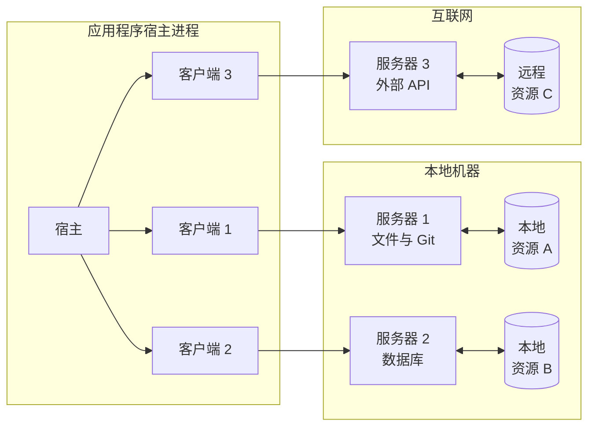
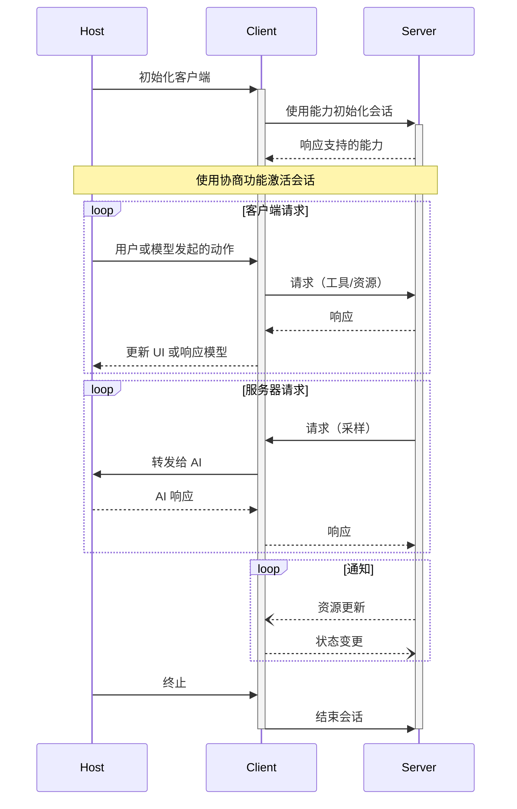

模型上下文协议（MCP）采用客户端-宿主-服务器架构，其中每个宿主可以运行多个客户端实例。这种架构使用户能够在应用程序中集成 AI 功能，同时保持清晰的安全边界和隔离关注点。MCP 基于 JSON-RPC，提供了一个专注于客户端与服务器之间上下文交换和采样协调的有状态会话协议。

## 核心组件

### 宿主

宿主进程作为容器和协调者：

- 创建和管理多个客户端实例
- 控制客户端连接权限和生命周期
- 强制执行安全策略和同意要求
- 处理用户授权决策
- 协调 AI/LLM 集成和采样
- 管理跨客户端的上下文聚合

### 客户端

每个客户端由宿主创建，并维护与服务器的隔离连接：

- 为每个服务器建立一个有状态会话
- 处理协议协商和能力交换
- 双向路由协议消息
- 管理订阅和通知
- 维护服务器之间的安全边界

宿主应用程序创建并管理多个客户端，每个客户端与特定服务器具有 1:1 关系。

### 服务器

服务器提供专门的上下文和能力：

- 通过 MCP 原语暴露资源、工具和提示
- 独立运行，专注于特定职责
- 通过客户端接口请求采样
- 必须遵守安全约束
- 可以是本地进程或远程服务

## 设计原则

MCP 基于几个关键设计原则，这些原则指导其架构和实现：

1. **服务器应极易构建**

   - 宿主应用程序处理复杂的编排职责
   - 服务器专注于特定、明确定义的能力
   - 简单接口减少实现开销
   - 清晰的分离支持代码可维护性

2. **服务器应高度可组合**

   - 每个服务器独立提供专注的功能
   - 多个服务器可以无缝组合
   - 共享协议支持互操作性
   - 模块化设计支持扩展性

3. **服务器不应能读取整个对话，也不能“窥视”其他服务器**

   - 服务器仅接收必要的上下文信息
   - 完整的对话历史保留在宿主中
   - 每个服务器连接保持隔离
   - 跨服务器交互由宿主控制
   - 宿主进程强制执行安全边界

4. **功能可逐步添加到服务器和客户端**
   - 核心协议提供最小的必需功能
   - 可根据需要协商额外的能力
   - 服务器和客户端可独立演进
   - 协议设计支持未来扩展
   - 保持向后兼容性

## 消息类型

MCP 基于 [JSON-RPC 2.0](https://www.jsonrpc.org/specification) 定义了三种核心消息类型：

- **请求**：带有方法和参数的双向消息，期望响应
- **响应**：匹配特定请求 ID 的成功结果或错误
- **通知**：无需响应的单向消息

每种消息类型遵循 JSON-RPC 2.0 规范的结构和传递语义。

## 能力协商

模型上下文协议使用基于能力的协商系统，客户端和服务器在初始化期间明确声明其支持的功能。能力决定了会话期间可用的协议功能和原语。

- 服务器声明能力，如资源订阅、工具支持和提示模板
- 客户端声明能力，如采样支持和通知处理
- 双方在整个会话中必须遵守声明的能力
- 可通过协议扩展协商额外的能力

每种能力为会话期间的使用解锁特定协议功能。例如：

- 实现的 [服务器功能](/specification/2024-11-05/server) 必须在服务器能力中声明
- 发出资源订阅通知要求服务器声明订阅支持
- 工具调用要求服务器声明工具能力
- [采样](/specification/2024-11-05/client) 要求客户端在其能力中声明支持

这种能力协商确保客户端和服务器清楚了解支持的功能，同时保持协议的可扩展性。