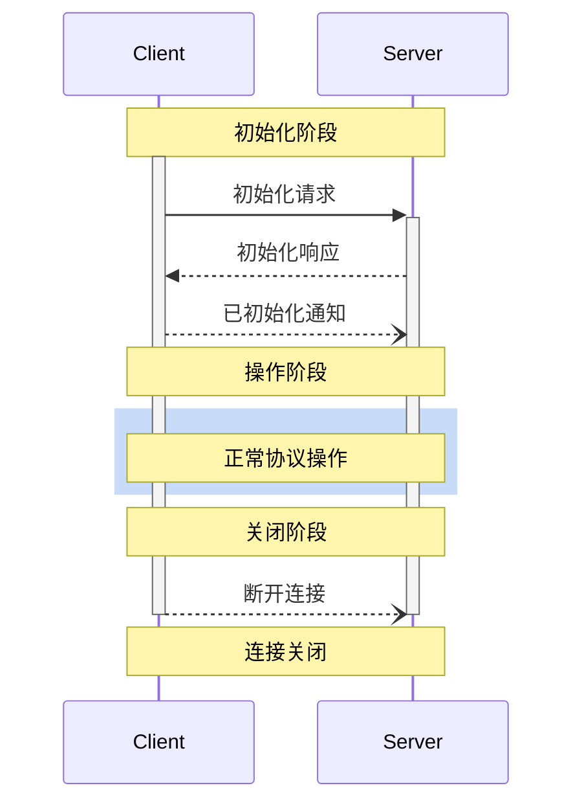

<Info>**协议修订版**：2024-11-05</Info>

模型上下文协议（MCP）为客户端-服务器连接定义了一个严格的生命周期，以确保适当的能力协商和状态管理。

1. **初始化**：能力协商和协议版本达成一致
2. **操作**：正常协议通信
3. **关闭**：连接的优雅终止



## 生命周期阶段

### 初始化

初始化阶段 **必须** 是客户端与服务器的首次交互。在此阶段，客户端和服务器：

- 建立协议版本兼容性
- 交换和协商能力
- 共享实现细节

客户端 **必须** 通过发送包含以下内容的 `initialize` 请求发起此阶段：

- 支持的协议版本
- 客户端能力
- 客户端实现信息

```json
{
  "jsonrpc": "2.0",
  "id": 1,
  "method": "initialize",
  "params": {
    "protocolVersion": "2024-11-05",
    "capabilities": {
      "roots": {
        "listChanged": true
      },
      "sampling": {}
    },
    "clientInfo": {
      "name": "ExampleClient",
      "version": "1.0.0"
    }
  }
}
```

服务器 **必须** 以其自身的能力和信息进行响应：

```json
{
  "jsonrpc": "2.0",
  "id": 1,
  "result": {
    "protocolVersion": "2024-11-05",
    "capabilities": {
      "logging": {},
      "prompts": {
        "listChanged": true
      },
      "resources": {
        "subscribe": true,
        "listChanged": true
      },
      "tools": {
        "listChanged": true
      }
    },
    "serverInfo": {
      "name": "ExampleServer",
      "version": "1.0.0"
    }
  }
}
```

成功初始化后，客户端 **必须** 发送 `initialized` 通知，以表明已准备好开始正常操作：

```json
{
  "jsonrpc": "2.0",
  "method": "notifications/initialized"
}
```

- 客户端在服务器响应 `initialize` 请求之前，**不得** 发送除 [心跳检测](/specification/2024-11-05/basic/utilities/ping) 外的其他请求。
- 服务器在收到 `initialized` 通知之前，**不得** 发送除 [心跳检测](/specification/2024-11-05/basic/utilities/ping) 和 [日志记录](/specification/2024-11-05/server/utilities/logging) 外的其他请求。

#### 版本协商

在 `initialize` 请求中，客户端 **必须** 发送其支持的协议版本。此版本 **应该** 是客户端支持的 _最新_ 版本。

如果服务器支持请求的协议版本，它 **必须** 以相同的版本响应。否则，服务器 **必须** 以其支持的另一个协议版本响应。此版本 **应该** 是服务器支持的 _最新_ 版本。

如果客户端不支持服务器响应中的版本，它 **应该** 断开连接。

#### 能力协商

客户端和服务器能力确定了会话期间可用的可选协议功能。

关键能力包括：

| 类别     | 能力           | 描述                                                                                       |
| -------- | -------------- | ------------------------------------------------------------------------------------------------- |
| 客户端   | `roots`        | 提供文件系统 [根目录](/specification/2024-11-05/client/roots) 的能力       |
| 客户端   | `sampling`     | 支持 LLM [采样](/specification/2024-11-05/client/sampling) 请求的能力      |
| 客户端   | `experimental` | 描述对非标准实验性功能的支持                                                              |
| 服务器   | `prompts`      | 提供 [提示模板](/specification/2024-11-05/server/prompts)                   |
| 服务器   | `resources`    | 提供可读 [资源](/specification/2024-11-05/server/resources)                 |
| 服务器   | `tools`        | 暴露可调用 [工具](/specification/2024-11-05/server/tools)                   |
| 服务器   | `logging`      | 发出结构化 [日志消息](/specification/2024-11-05/server/utilities/logging)   |
| 服务器   | `experimental` | 描述对非标准实验性功能的支持                                                              |

能力对象可以描述子能力，例如：

- `listChanged`：支持列表变更通知（适用于提示、资源和工具）
- `subscribe`：支持订阅单个项目的变更（仅适用于资源）

### 操作

在操作阶段，客户端和服务器根据协商的能力交换消息。

双方 **应该**：

- 遵守协商的协议版本
- 仅使用成功协商的能力

### 关闭

在关闭阶段，通常由一方（通常是客户端）干净地终止协议连接。没有定义特定的关闭消息——应使用底层的传输机制来指示连接终止：

#### stdio

对于 stdio [传输](/specification/2024-11-05/basic/transports)，客户端 **应该** 通过以下步骤发起关闭：

1. 首先关闭子进程（服务器）的输入流
2. 等待服务器退出，或在合理时间内未退出时发送 `SIGTERM`
3. 如果在发送 `SIGTERM` 后的合理时间内服务器仍未退出，则发送 `SIGKILL`

服务器 **可以** 通过关闭其对客户端的输出流并退出以发起关闭。

#### HTTP

对于 HTTP [传输](/specification/2024-11-05/basic/transports)，关闭通过关闭相关的 HTTP 连接来指示。

## 错误处理

实现 **应该** 准备处理以下错误情况：

- 协议版本不匹配
- 无法协商所需能力
- 初始化请求超时
- 关闭超时

实现 **应该** 为所有请求实施适当的超时，以防止连接挂起和资源耗尽。

初始化错误示例：

```json
{
  "jsonrpc": "2.0",
  "id": 1,
  "error": {
    "code": -32602,
    "message": "不支持的协议版本",
    "data": {
      "supported": ["2024-11-05"],
      "requested": "1.0.0"
    }
  }
}
```