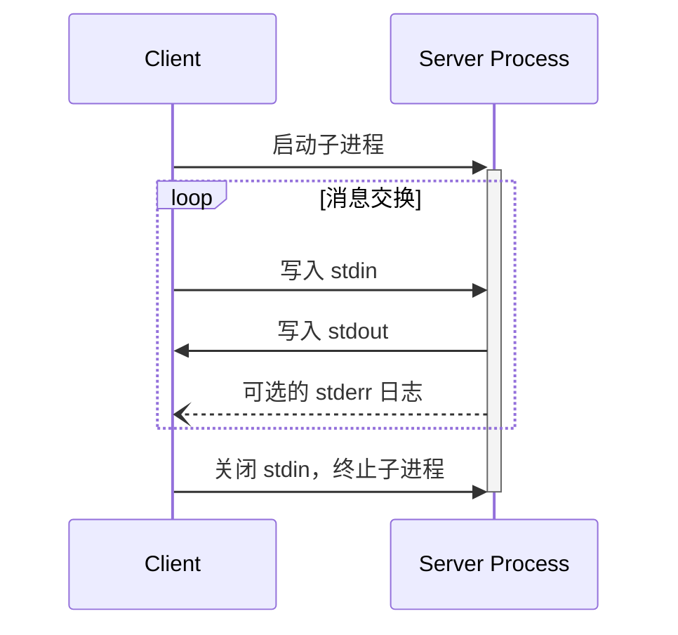
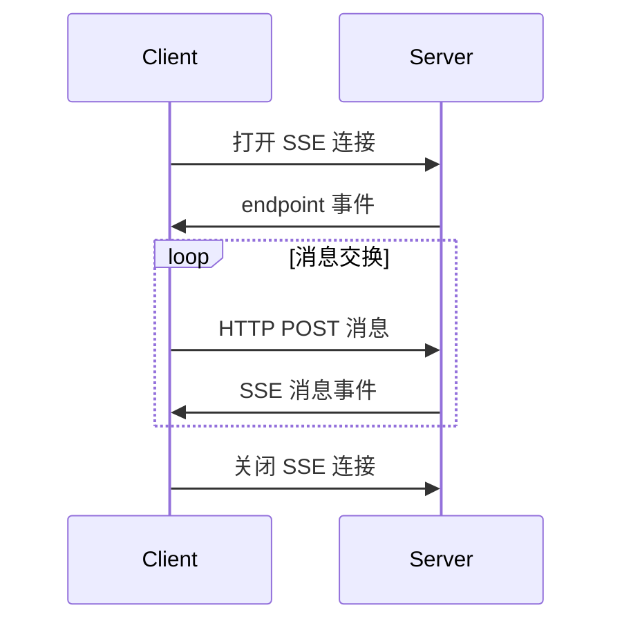

<Info>**协议修订版**：2024-11-05</Info>

MCP 目前定义了两种标准的客户端-服务器通信传输机制：

1. [stdio](#stdio)，通过标准输入和标准输出进行通信
2. [HTTP 与服务器发送事件](#http-with-sse)（SSE）

客户端 **应该** 尽可能支持 stdio。

客户端和服务器也可以以可插拔的方式实现 [自定义传输机制](#custom-transports)。

## stdio

在 **stdio** 传输机制中：

- 客户端将 MCP 服务器作为子进程启动。
- 服务器通过其标准输入（`stdin`）接收 JSON-RPC 消息，并将响应写入其标准输出（`stdout`）。
- 消息以换行符分隔，且 **不得** 包含嵌入的换行符。
- 服务器 **可以** 将 UTF-8 字符串写入其标准错误（`stderr`）用于日志记录。客户端 **可以** 捕获、转发或忽略这些日志。
- 服务器 **不得** 将任何非有效 MCP 消息的内容写入其 `stdout`。
- 客户端 **不得** 将任何非有效 MCP 消息的内容写入服务器的 `stdin`。

## HTTP 与 SSE

在 **SSE** 传输机制中，服务器作为一个独立进程运行，可以处理多个客户端连接。

#### 安全警告

实现 HTTP 与 SSE 传输机制时：

1. 服务器 **必须** 验证所有传入连接的 `Origin` 头，以防止 DNS 重绑定攻击
2. 在本地运行时，服务器 **应该** 仅绑定到 localhost（127.0.0.1），而不是所有网络接口（0.0.0.0）
3. 服务器 **应该** 为所有连接实现适当的认证

如果没有这些保护措施，攻击者可能通过 DNS 重绑定从远程网站与本地 MCP 服务器交互。

服务器 **必须** 提供两个端点：

1. 一个 SSE 端点，供客户端建立连接并从服务器接收消息
2. 一个常规 HTTP POST 端点，供客户端向服务器发送消息

当客户端连接时，服务器 **必须** 发送一个包含客户端用于发送消息的 URI 的 `endpoint` 事件。所有后续客户端消息 **必须** 作为 HTTP POST 请求发送到此端点。

服务器消息以 SSE `message` 事件的形式发送，消息内容在事件数据中编码为 JSON。

## 自定义传输机制

客户端和服务器 **可以** 实现额外的自定义传输机制，以满足其特定需求。协议与传输无关，可以在任何支持双向消息交换的通信通道上实现。

选择支持自定义传输的实现者 **必须** 确保其保留 MCP 定义的 JSON-RPC 消息格式和生命周期要求。自定义传输 **应该** 记录其特定的连接建立和消息交换模式，以促进互操作性。