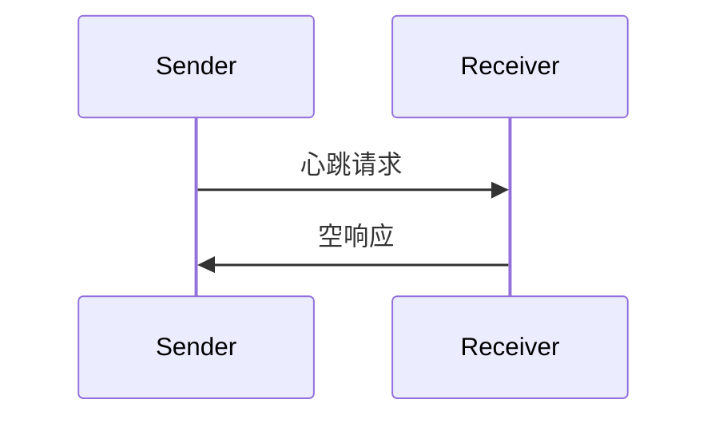

<Info>**协议修订版**：2024-11-05</Info>

模型上下文协议（MCP）包括一个可选的心跳检测机制，允许任一方验证对方是否仍保持响应以及连接是否活跃。

## 概览

心跳检测功能通过简单的请求/响应模式实现。客户端或服务器均可通过发送 `ping` 请求发起心跳检测。

## 消息格式

心跳请求是一个标准的 JSON-RPC 请求，不带参数：

```json
{
  "jsonrpc": "2.0",
  "id": "123",
  "method": "ping"
}
```

## 行为要求

1. 接收方 **必须** 迅速响应一个空响应：

```json
{
  "jsonrpc": "2.0",
  "id": "123",
  "result": {}
}
```

2. 如果在合理的超时时间内未收到响应，发送方 **可以**：
   - 认为连接已失效
   - 终止连接
   - 尝试重新连接流程

## 使用模式



## 实现注意事项

- 实现 **应该** 定期发出心跳请求以检测连接健康状态
- 心跳的频率 **应该** 是可配置的
- 超时时间 **应该** 适合网络环境
- **应该** 避免过度发送心跳请求以减少网络开销

## 错误处理

- 超时 **应该** 被视为连接失败
- 多次心跳失败 **可以** 触发连接重置
- 实现 **应该** 记录心跳失败以供诊断