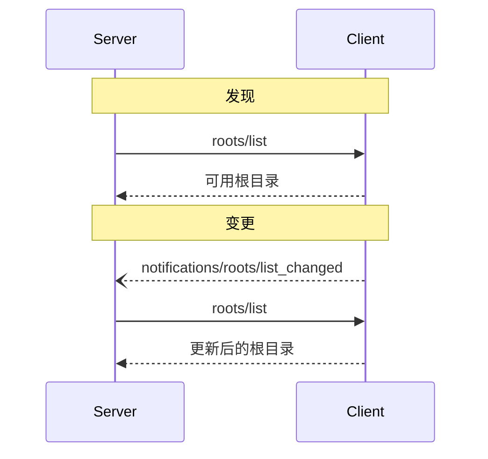

<Info>**协议修订版**：2024-11-05</Info>

模型上下文协议（MCP）为客户端提供了一种标准化的方式，向服务器暴露文件系统的“根目录”。根目录定义了服务器在文件系统中的操作边界，使服务器能够了解其可以访问的目录和文件。服务器可以从支持根目录的客户端请求根目录列表，并在列表发生变化时接收通知。

## 用户交互模型

MCP 中的根目录通常通过工作区或项目配置界面暴露。

例如，实现可以提供一个工作区/项目选择器，允许用户选择服务器应有权访问的目录和文件。这可以与从版本控制系统或项目文件自动检测工作区相结合。

然而，实现可以自由选择适合其需求的任何界面模式来暴露根目录——协议本身不强制要求特定的用户交互模型。

## 能力

支持根目录的客户端 **必须** 在 [初始化](/specification/2024-11-05/basic/lifecycle#initialization) 期间声明 `roots` 能力：

```json
{
  "capabilities": {
    "roots": {
      "listChanged": true
    }
  }
}
```

`listChanged` 指示客户端是否会在根目录列表发生变化时发出通知。

## 协议消息

### 列出根目录

要检索根目录，服务器发送 `roots/list` 请求：

**请求：**

```json
{
  "jsonrpc": "2.0",
  "id": 1,
  "method": "roots/list"
}
```

**响应：**

```json
{
  "jsonrpc": "2.0",
  "id": 1,
  "result": {
    "roots": [
      {
        "uri": "file:///home/user/projects/myproject",
        "name": "我的项目"
      }
    ]
  }
}
```

### 根目录列表变更

当根目录发生变化时，支持 `listChanged` 的客户端 **必须** 发送通知：

```json
{
  "jsonrpc": "2.0",
  "method": "notifications/roots/list_changed"
}
```

## 消息流程



## 数据类型

### 根目录

根目录定义包括：

- `uri`：根目录的唯一标识符。在当前规范中，此值 **必须** 为 `file://` URI。
- `name`：可选的人类可读名称，用于显示。

不同用例的根目录示例：

#### 项目目录

```json
{
  "uri": "file:///home/user/projects/myproject",
  "name": "我的项目"
}
```

#### 多个存储库

```json
[
  {
    "uri": "file:///home/user/repos/frontend",
    "name": "前端存储库"
  },
  {
    "uri": "file:///home/user/repos/backend",
    "name": "后端存储库"
  }
]
```

## 错误处理

客户端 **应该** 为常见失败情况返回标准的 JSON-RPC 错误：

- 客户端不支持根目录：`-32601`（方法未找到）
- 内部错误：`-32603`

错误示例：

```json
{
  "jsonrpc": "2.0",
  "id": 1,
  "error": {
    "code": -32601,
    "message": "不支持根目录",
    "data": {
      "reason": "客户端不具备根目录能力"
    }
  }
}
```

## 安全考虑

1. 客户端 **必须**：

   - 仅暴露具有适当权限的根目录
   - 验证所有根目录 URI 以防止路径穿越
   - 实施适当的访问控制
   - 监控根目录的可访问性

2. 服务器 **应该**：
   - 处理根目录不可用的情况
   - 在操作期间遵守根目录边界
   - 针对提供的根目录验证所有路径

## 实现指南

1. 客户端 **应该**：

   - 在向服务器暴露根目录前提示用户同意
   - 提供清晰的根目录管理用户界面
   - 在暴露前验证根目录的可访问性
   - 监控根目录的变更

2. 服务器 **应该**：
   - 在使用前检查根目录能力
   - 优雅地处理根目录列表变更
   - 在操作中遵守根目录边界
   - 适当缓存根目录信息