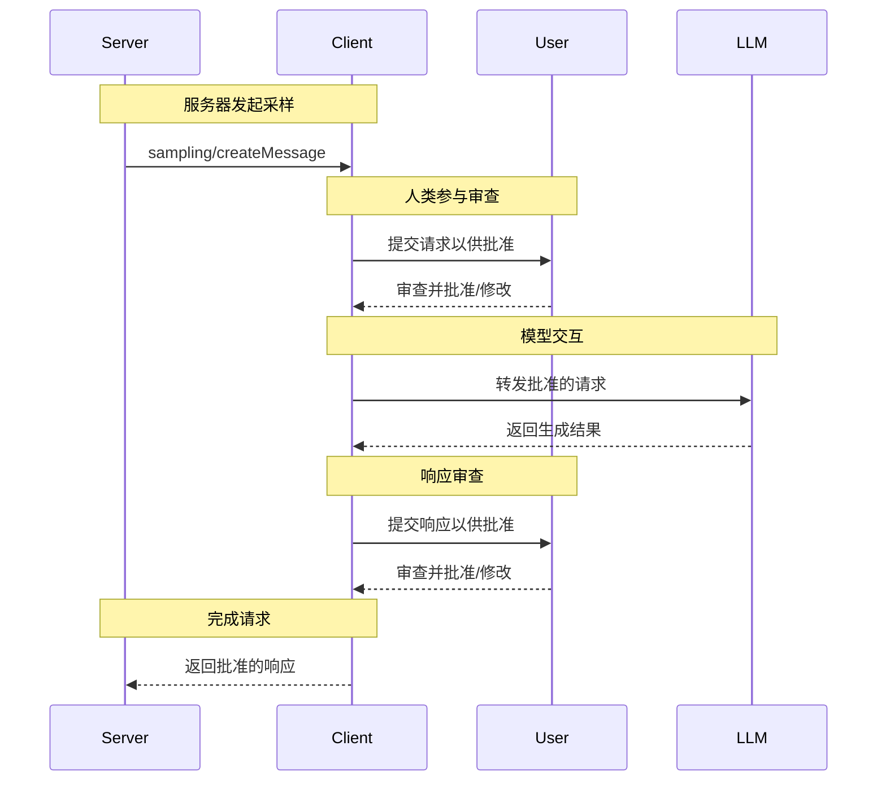

<Info>**协议修订版**：2024-11-05</Info>

模型上下文协议（MCP）为服务器提供了一种标准化的方式，通过客户端从语言模型请求 LLM 采样（“完成”或“生成”）。此流程允许客户端保持对模型访问、选择和权限的控制，同时使服务器能够利用 AI 能力——无需服务器持有 API 密钥。服务器可以请求基于文本或图像的交互，并可选地在提示中包含来自 MCP 服务器的上下文。

## 用户交互模型

MCP 中的采样允许服务器通过在其他 MCP 服务器功能内 _嵌套_ 调用 LLM 来实现代理行为。

实现可以自由选择适合其需求的任何界面模式来暴露采样——协议本身不强制要求特定的用户交互模型。

<Warning>
为了信任、安全和保障，**应该** 始终有一个人类参与者，能够拒绝采样请求。

应用程序 **应该**：

- 提供易于直观审查采样请求的 UI
- 允许用户在发送前查看和编辑提示
- 在交付前展示生成的响应以供审查
</Warning>

## 能力

支持采样的客户端 **必须** 在 [初始化](/specification/2024-11-05/basic/lifecycle#initialization) 期间声明 `sampling` 能力：

```json
{
  "capabilities": {
    "sampling": {}
  }
}
```

## 协议消息

### 创建消息

要请求语言模型生成，服务器发送 `sampling/createMessage` 请求：

**请求：**

```json
{
  "jsonrpc": "2.0",
  "id": 1,
  "method": "sampling/createMessage",
  "params": {
    "messages": [
      {
        "role": "user",
        "content": {
          "type": "text",
          "text": "法国的首都是什么？"
        }
      }
    ],
    "modelPreferences": {
      "hints": [
        {
          "name": "claude-3-sonnet"
        }
      ],
      "intelligencePriority": 0.8,
      "speedPriority": 0.5
    },
    "systemPrompt": "你是一个乐于助人的助手。",
    "maxTokens": 100
  }
}
```

**响应：**

```json
{
  "jsonrpc": "2.0",
  "id": 1,
  "result": {
    "role": "assistant",
    "content": {
      "type": "text",
      "text": "法国的首都是巴黎。"
    },
    "model": "claude-3-sonnet-20240307",
    "stopReason": "endTurn"
  }
}
```

## 消息流程



## 数据类型

### 消息

采样消息可以包含：

#### 文本内容

```json
{
  "type": "text",
  "text": "消息内容"
}
```

#### 图像内容

```json
{
  "type": "image",
  "data": "base64编码的图像数据",
  "mimeType": "image/jpeg"
}
```

### 模型偏好

MCP 中的模型选择需要谨慎抽象，因为服务器和客户端可能使用不同 AI 提供商的不同模型。服务器不能简单地按名称请求特定模型，因为客户端可能无法访问该模型，或者可能更喜欢使用不同提供商的等效模型。

为解决此问题，MCP 实现了一个结合抽象能力优先级和可选模型提示的偏好系统：

#### 能力优先级

服务器通过三个标准化优先级值（0-1）表达其需求：

- `costPriority`：降低成本的重要性？值越高，优先选择成本较低的模型。
- `speedPriority`：低延迟的重要性？值越高，优先选择更快的模型。
- `intelligencePriority`：高级能力的重要性？值越高，优先选择更强大的模型。

#### 模型提示

虽然优先级有助于根据特性选择模型，但 `hints` 允许服务器建议特定模型或模型系列：

- 提示被视为可以灵活匹配模型名称的子字符串
- 多个提示按偏好顺序评估
- 客户端 **可以** 将提示映射到不同提供商的等效模型
- 提示仅为建议——客户端最终决定模型选择

例如：

```json
{
  "hints": [
    { "name": "claude-3-sonnet" }, // 优先选择 Sonnet 类模型
    { "name": "claude" } // 回退到任何 Claude 模型
  ],
  "costPriority": 0.3, // 成本不太重要
  "speedPriority": 0.8, // 速度非常重要
  "intelligencePriority": 0.5 // 中等能力需求
}
```

客户端根据这些偏好从其可用选项中选择合适的模型。例如，如果客户端无法访问 Claude 模型但有 Gemini，它可能基于相似能力将 sonnet 提示映射到 `gemini-1.5-pro`。

## 错误处理

客户端 **应该** 为常见失败情况返回错误：

错误示例：

```json
{
  "jsonrpc": "2.0",
  "id": 1,
  "error": {
    "code": -1,
    "message": "用户拒绝采样请求"
  }
}
```

## 安全考虑

1. 客户端 **应该** 实现用户批准控制
2. 双方 **应该** 验证消息内容
3. 客户端 **应该** 尊重模型偏好提示
4. 客户端 **应该** 实现速率限制
5. 双方 **必须** 适当处理敏感数据