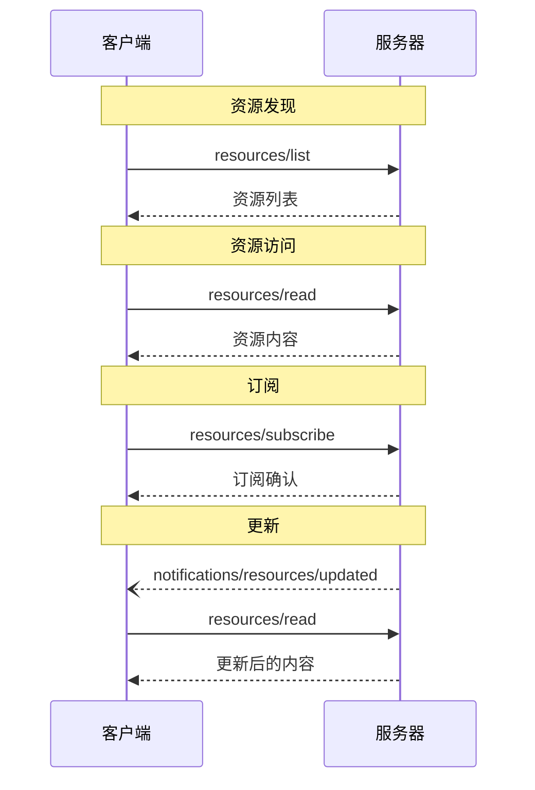

<Info>**协议修订**：2024-11-05</Info>

模型上下文协议（MCP）为服务器向客户端公开资源提供了一种标准化的方式。资源允许服务器共享为语言模型提供上下文的数据，例如文件、数据库模式或应用程序特定信息。每个资源通过[URI](https://datatracker.ietf.org/doc/html/rfc3986)唯一标识。

## 用户交互模型

MCP 中的资源被设计为 **应用程序驱动**，主机应用程序根据其需求决定如何融入上下文。

例如，应用程序可以：

- 通过用户界面元素公开资源以进行明确选择，例如树形视图或列表视图
- 允许用户搜索和过滤可用资源
- 根据启发式方法或 AI 模型的选择实现自动上下文包含


然而，实现者可以根据需要通过任何适合的界面模式公开资源——协议本身不强制任何特定的用户交互模型。

## 能力

支持资源的服务器 **必须** 声明 `resources` 能力：

```json
{
  "capabilities": {
    "resources": {
      "subscribe": true,
      "listChanged": true
    }
  }
}
```

该能力支持两个可选功能：

- `subscribe`：客户端是否可以订阅以接收单个资源变更的通知。
- `listChanged`：服务器在可用资源列表发生变化时是否会发出通知。

`subscribe` 和 `listChanged` 都是可选的——服务器可以不支持任一功能、支持其中之一或两者都支持：

```json
{
  "capabilities": {
    "resources": {} // 不支持任一功能
  }
}
```

```json
{
  "capabilities": {
    "resources": {
      "subscribe": true // 仅支持订阅
    }
  }
}
```

```json
{
  "capabilities": {
    "resources": {
      "listChanged": true // 仅支持列表变更通知
    }
  }
}
```

## 协议消息

### 列出资源

要发现可用资源，客户端发送 `resources/list` 请求。此操作支持[分页](/specification/2024-11-05/server/utilities/pagination)。

**请求：**

```json
{
  "jsonrpc": "2.0",
  "id": 1,
  "method": "resources/list",
  "params": {
    "cursor": "optional-cursor-value"
  }
}
```

**响应：**

```json
{
  "jsonrpc": "2.0",
  "id": 1,
  "result": {
    "resources": [
      {
        "uri": "file:///project/src/main.rs",
        "name": "main.rs",
        "description": "主应用程序入口点",
        "mimeType": "text/x-rust"
      }
    ],
    "nextCursor": "next-page-cursor"
  }
}
```

### 读取资源

要检索资源内容，客户端发送 `resources/read` 请求：

**请求：**

```json
{
  "jsonrpc": "2.0",
  "id": 2,
  "method": "resources/read",
  "params": {
    "uri": "file:///project/src/main.rs"
  }
}
```

**响应：**

```json
{
  "jsonrpc": "2.0",
  "id": 2,
  "result": {
    "contents": [
      {
        "uri": "file:///project/src/main.rs",
        "mimeType": "text/x-rust",
        "text": "fn main() {\n    println!(\"Hello world!\");\n}"
      }
    ]
  }
}
```

### 资源模板

资源模板允许服务器使用[URI 模板](https://datatracker.ietf.org/doc/html/rfc6570)公开参数化资源。参数可以通过[完成 API](/specification/2024-11-05/server/utilities/completion)自动完成。

**请求：**

```json
{
  "jsonrpc": "2.0",
  "id": 3,
  "method": "resources/templates/list"
}
```

**响应：**

```json
{
  "jsonrpc": "2.0",
  "id": 3,
  "result": {
    "resourceTemplates": [
      {
        "uriTemplate": "file:///{path}",
        "name": "项目文件",
        "description": "访问项目目录中的文件",
        "mimeType": "application/octet-stream"
      }
    ]
  }
}
```

### 列表变更通知

当可用资源列表发生变化时，声明了 `listChanged` 能力的服务器 **应该** 发送通知：

```json
{
  "jsonrpc": "2.0",
  "method": "notifications/resources/list_changed"
}
```

### 订阅

协议支持对资源变更的可选订阅。客户端可以订阅特定资源，并在资源发生变化时接收通知：

**订阅请求：**

```json
{
  "jsonrpc": "2.0",
  "id": 4,
  "method": "resources/subscribe",
  "params": {
    "uri": "file:///project/src/main.rs"
  }
}
```

**更新通知：**

```json
{
  "jsonrpc": "2.0",
  "method": "notifications/resources/updated",
  "params": {
    "uri": "file:///project/src/main.rs"
  }
}
```

## 消息流程



## 数据类型

### 资源

资源定义包括：

- `uri`：资源的唯一标识符
- `name`：人类可读的名称
- `description`：可选的描述
- `mimeType`：可选的 MIME 类型

### 资源内容

资源可以包含文本或二进制数据：

#### 文本内容

```json
{
  "uri": "file:///example.txt",
  "mimeType": "text/plain",
  "text": "资源内容"
}
```

#### 二进制内容

```json
{
  "uri": "file:///example.png",
  "mimeType": "image/png",
  "blob": "base64-encoded-data"
}
```

## 常见 URI 方案

协议定义了几个标准 URI 方案。此列表并非详尽无遗——实现者始终可以自由使用额外的自定义 URI 方案。

### https://

用于表示网络上可用的资源。

服务器 **应该** 仅在客户端能够直接从网络上获取和加载资源时使用此方案——即不需要通过 MCP 服务器读取资源。

对于其他用例，服务器 **应该** 优先使用其他 URI 方案，或定义一个自定义方案，即使服务器本身会通过互联网下载资源内容。

### file://

用于标识类似文件系统的资源。然而，资源不需要映射到实际的物理文件系统。

MCP 服务器 **可以** 使用[XDG MIME 类型](https://specifications.freedesktop.org/shared-mime-info-spec/0.14/ar01s02.html#id-1.3.14)（如 `inode/directory`）标识 file:// 资源，以表示非常规文件（例如目录），这些文件通常没有标准 MIME 类型。

### git://

Git 版本控制集成。

## 错误处理

服务器 **应该** 为常见失败情况返回标准的 JSON-RPC 错误：

- 资源未找到：`-32002`
- 内部错误：`-32603`

错误示例：

```json
{
  "jsonrpc": "2.0",
  "id": 5,
  "error": {
    "code": -32002,
    "message": "资源未找到",
    "data": {
      "uri": "file:///nonexistent.txt"
    }
  }
}
```

## 安全注意事项

1. 服务器 **必须** 验证所有资源 URI
2. 对于敏感资源 **应该** 实现访问控制
3. 二进制数据 **必须** 正确编码
4. 在执行操作前 **应该** 检查资源权限
