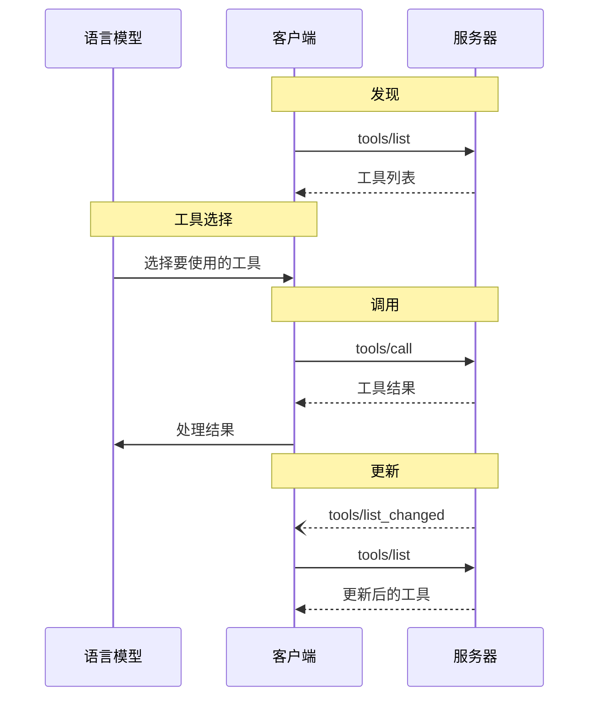

<Info>**协议修订**：2024-11-05</Info>

模型上下文协议（MCP）允许服务器公开可由语言模型调用的工具。工具使模型能够与外部系统交互，例如查询数据库、调用 API 或执行计算。每个工具通过名称唯一标识，并包含描述其模式的元数据。

## 用户交互模型

MCP 中的工具被设计为 **模型控制**，这意味着语言模型可以根据其上下文理解和用户的提示自动发现和调用工具。

然而，实现者可以根据需要通过任何适合的界面模式公开工具——协议本身不强制任何特定的用户交互模型。

<Warning>
为了信任、安全和保障，**应该** 始终有一个人类参与循环，具备拒绝工具调用的能力。

应用程序 **应该**：

- 提供清晰的 UI，显示哪些工具被暴露给 AI 模型
- 在工具被调用时插入清晰的视觉指示
- 为操作提供用户确认提示，以确保有人类参与循环
</Warning>

## 能力

支持工具的服务器 **必须** 声明 `tools` 能力：

```json
{
  "capabilities": {
    "tools": {
      "listChanged": true
    }
  }
}
```

`listChanged` 表示服务器在可用工具列表发生变化时是否会发出通知。

## 协议消息

### 列出工具

要发现可用工具，客户端发送 `tools/list` 请求。此操作支持[分页](/specification/2024-11-05/server/utilities/pagination)。

**请求：**

```json
{
  "jsonrpc": "2.0",
  "id": 1,
  "method": "tools/list",
  "params": {
    "cursor": "optional-cursor-value"
  }
}
```

**响应：**

```json
{
  "jsonrpc": "2.0",
  "id": 1,
  "result": {
    "tools": [
      {
        "name": "get_weather",
        "description": "获取指定位置的当前天气信息",
        "inputSchema": {
          "type": "object",
          "properties": {
            "location": {
              "type": "string",
              "description": "城市名称或邮政编码"
            }
          },
          "required": ["location"]
        }
      }
    ],
    "nextCursor": "next-page-cursor"
  }
}
```

### 调用工具

要调用工具，客户端发送 `tools/call` 请求：

**请求：**

```json
{
  "jsonrpc": "2.0",
  "id": 2,
  "method": "tools/call",
  "params": {
    "name": "get_weather",
    "arguments": {
      "location": "New York"
    }
  }
}
```

**响应：**

```json
{
  "jsonrpc": "2.0",
  "id": 2,
  "result": {
    "content": [
      {
        "type": "text",
        "text": "纽约当前天气：\n温度：72°F\n天气状况：部分多云"
      }
    ],
    "isError": false
  }
}
```

### 列表变更通知

当可用工具列表发生变化时，声明了 `listChanged` 能力的服务器 **应该** 发送通知：

```json
{
  "jsonrpc": "2.0",
  "method": "notifications/tools/list_changed"
}
```

## 消息流程



## 数据类型

### 工具

工具定义包括：

- `name`：工具的唯一标识符
- `description`：功能的人类可读描述
- `inputSchema`：定义预期参数的 JSON 模式

### 工具结果

工具结果可以包含不同类型的多个内容项：

#### 文本内容

```json
{
  "type": "text",
  "text": "工具结果文本"
}
```

#### 图像内容

```json
{
  "type": "image",
  "data": "base64-encoded-data",
  "mimeType": "image/png"
}
```

#### 嵌入资源

[资源](/specification/2024-11-05/server/resources) **可以** 被嵌入，以提供额外的上下文或数据，位于客户端稍后可以订阅或再次获取的 URI 后面：

```json
{
  "type": "resource",
  "resource": {
    "uri": "resource://example",
    "mimeType": "text/plain",
    "text": "资源内容"
  }
}
```

## 错误处理

工具使用两种错误报告机制：

1. **协议错误**：用于以下问题的标准 JSON-RPC 错误：
   - 未知工具
   - 无效参数
   - 服务器错误

2. **工具执行错误**：在工具结果中报告，带有 `isError: true`：
   - API 失败
   - 无效输入数据
   - 业务逻辑错误

协议错误示例：

```json
{
  "jsonrpc": "2.0",
  "id": 3,
  "error": {
    "code": -32602,
    "message": "未知工具：invalid_tool_name"
  }
}
```

工具执行错误示例：

```json
{
  "jsonrpc": "2.0",
  "id": 4,
  "result": {
    "content": [
      {
        "type": "text",
        "text": "无法获取天气数据：API 速率限制超限"
      }
    ],
    "isError": true
  }
}
```

## 安全注意事项

1. 服务器 **必须**：
   - 验证所有工具输入
   - 实现适当的访问控制
   - 对工具调用进行速率限制
   - 清理工具输出

2. 客户端 **应该**：
   - 对敏感操作提示用户确认
   - 在调用服务器前向用户显示工具输入，以避免恶意或意外的数据泄露
   - 在传递给语言模型前验证工具结果
   - 为工具调用实现超时
   - 记录工具使用情况以供审计
