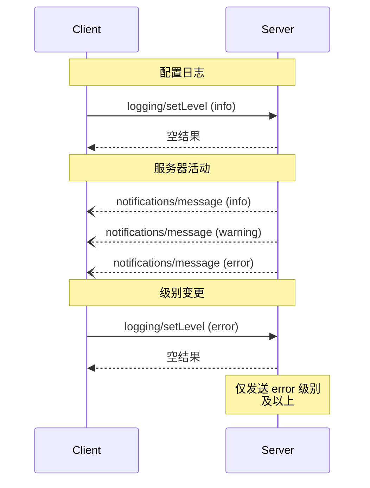

<Info>**协议修订版**：2024-11-05</Info>

模型上下文协议（MCP）为服务器提供了一种标准化的方式，向客户端发送结构化日志消息。客户端可以通过设置最低日志级别来控制日志详细程度，服务器发送包含严重性级别、可选日志记录器名称和任意 JSON 可序列化数据的通知。

## 用户交互模型

实现可以自由选择适合其需求的任何界面模式来暴露日志记录——协议本身不强制要求特定的用户交互模型。

## 能力

发出日志消息通知的服务器 **必须** 声明 `logging` 能力：

```json
{
  "capabilities": {
    "logging": {}
  }
}
```

## 日志级别

协议遵循 [RFC 5424](https://datatracker.ietf.org/doc/html/rfc5424#section-6.2.1) 中指定的标准 syslog 严重性级别：

| 级别      | 描述                             | 示例用例                   |
| --------- | -------------------------------- | -------------------------- |
| debug     | 详细的调试信息                   | 函数进入/退出点            |
| info      | 常规信息消息                     | 操作进度更新               |
| notice    | 正常但重要的事件                 | 配置变更                   |
| warning   | 警告条件                         | 使用已弃用的功能           |
| error     | 错误条件                         | 操作失败                   |
| critical  | 严重条件                         | 系统组件故障               |
| alert     | 必须立即采取行动                 | 检测到数据损坏             |
| emergency | 系统不可用                       | 完全系统故障               |

## 协议消息

### 设置日志级别

要配置最低日志级别，客户端 **可以** 发送 `logging/setLevel` 请求：

**请求：**

```json
{
  "jsonrpc": "2.0",
  "id": 1,
  "method": "logging/setLevel",
  "params": {
    "level": "info"
  }
}
```

### 日志消息通知

服务器使用 `notifications/message` 通知发送日志消息：

```json
{
  "jsonrpc": "2.0",
  "method": "notifications/message",
  "params": {
    "level": "error",
    "logger": "database",
    "data": {
      "error": "连接失败",
      "details": {
        "host": "localhost",
        "port": 5432
      }
    }
  }
}
```

## 消息流程



## 错误处理

服务器 **应该** 为常见失败情况返回标准的 JSON-RPC 错误：

- 无效日志级别：`-32602`（参数无效）
- 配置错误：`-32603`（内部错误）

## 实现注意事项

1. 服务器 **应该**：

   - 对日志消息进行速率限制
   - 在数据字段中包含相关上下文
   - 使用一致的日志记录器名称
   - 删除敏感信息

2. 客户端 **可以**：
   - 在 UI 中呈现日志消息
   - 实现日志过滤/搜索
   - 以视觉方式显示严重性
   - 持久化日志消息

## 安全

1. 日志消息 **不得** 包含：

   - 凭据或秘密
   - 个人身份信息
   - 可助攻攻击的内部系统细节

2. 实现 **应该**：
   - 对消息进行速率限制
   - 验证所有数据字段
   - 控制日志访问
   - 监控敏感内容