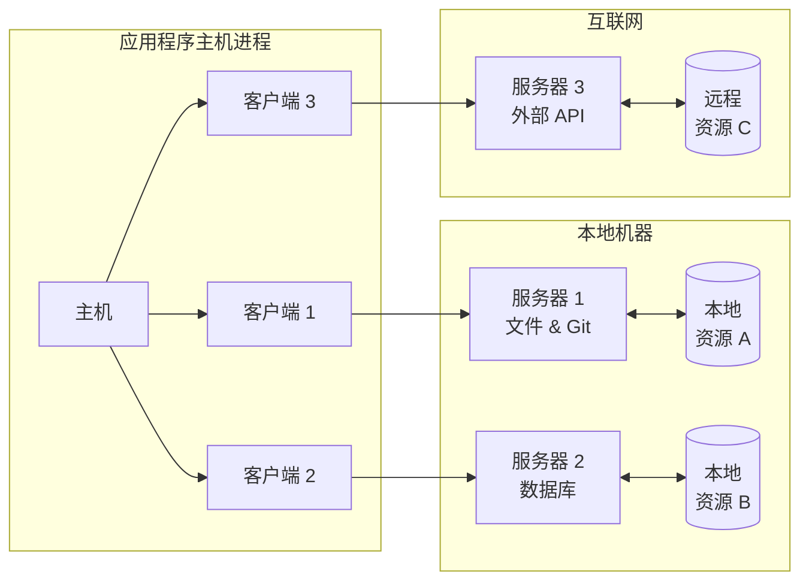
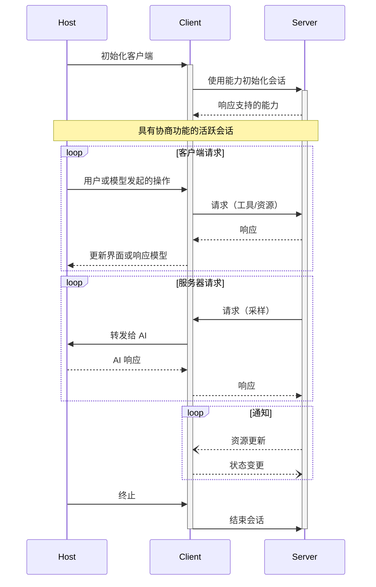

模型上下文协议（MCP）采用客户端-主机-服务器架构，其中每个主机可以运行多个客户端实例。这种架构使用户能够在应用程序中集成 AI 功能，同时保持清晰的安全边界和隔离关注点。基于 JSON-RPC，MCP 提供了一个有状态的会话协议，专注于客户端与服务器之间的上下文交换和采样协调。

## 核心组件

### 主机

主机进程作为容器和协调者：

- 创建和管理多个客户端实例
- 控制客户端连接权限和生命周期
- 强制执行安全策略和同意要求
- 处理用户授权决策
- 协调 AI/大语言模型集成和采样
- 管理跨客户端的上下文聚合

### 客户端

每个客户端由主机创建，并维护一个独立的服务器连接：

- 为每个服务器建立一个有状态会话
- 处理协议协商和能力交换
- 双向路由协议消息
- 管理订阅和通知
- 维护服务器之间的安全边界

主机应用程序创建并管理多个客户端，每个客户端与特定服务器具有 1:1 的关系。

### 服务器

服务器提供专门的上下文和功能：

- 通过 MCP 原语暴露资源、工具和提示
- 以专注的职责独立运行
- 通过客户端接口请求采样
- 必须遵守安全约束
- 可以是本地进程或远程服务

## 设计原则

MCP 基于以下几个关键设计原则，这些原则指导了其架构和实现：

1. **服务器应极易构建**

   - 主机应用程序处理复杂的编排职责
   - 服务器专注于特定的、定义明确的功能
   - 简单接口减少实现开销
   - 清晰的分离支持可维护的代码

2. **服务器应高度可组合**

   - 每个服务器独立提供专注的功能
   - 多个服务器可以无缝组合
   - 共享协议支持互操作性
   - 模块化设计支持扩展性

3. **服务器不应能读取整个对话，也不能“窥视”其他服务器**

   - 服务器仅接收必要的上下文信息
   - 完整的对话历史保留在主机中
   - 每个服务器连接保持隔离
   - 跨服务器交互由主机控制
   - 主机进程强制执行安全边界

4. **功能可以逐步添加到服务器和客户端**
   - 核心协议提供最小的必需功能
   - 可根据需要协商附加功能
   - 服务器和客户端可独立演进
   - 协议设计支持未来扩展
   - 保持向后兼容性

## 能力协商

模型上下文协议使用基于能力的协商系统，客户端和服务器在初始化期间明确声明其支持的功能。能力决定了会话期间可用的协议功能和原语。

- 服务器声明的功能包括资源订阅、工具支持和提示模板
- 客户端声明的功能包括采样支持和通知处理
- 双方在整个会话中必须遵守声明的功能
- 可通过协议扩展协商附加功能

每种能力为会话期间解锁特定的协议功能。例如：

- 实现的 [服务器功能](/specification/2025-03-26/server) 必须在服务器的能力中声明
- 发送资源订阅通知要求服务器声明支持订阅
- 工具调用要求服务器声明工具能力
- [采样](/specification/2025-03-26/client) 要求客户端在其能力中声明支持

这种能力协商确保客户端和服务器对支持的功能有清晰的理解，同时保持协议的可扩展性。
