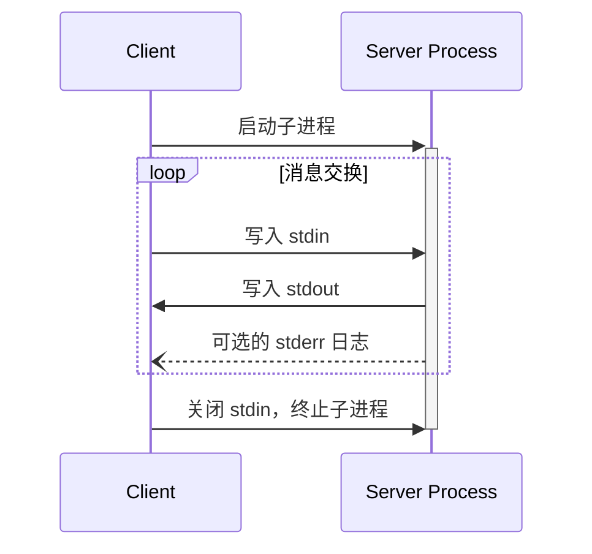
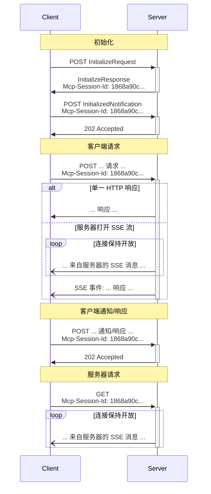

<Info>**协议修订版**：2025-03-26</Info>

MCP 使用 JSON-RPC 编码消息。JSON-RPC 消息 **必须** 使用 UTF-8 编码。

协议当前定义了两种用于客户端-服务器通信的标准传输机制：

1. [标准输入输出](#stdio)，通过标准输入和标准输出进行通信
2. [可流式 HTTP](#streamable-http)

客户端 **应该** 尽可能支持标准输入输出。

客户端和服务器也可以以可插拔的方式实现 [自定义传输](#custom-transports)。

## 标准输入输出

在 **标准输入输出** 传输中：

- 客户端将 MCP 服务器作为子进程启动。
- 服务器从其标准输入（`stdin`）读取 JSON-RPC 消息，并将消息发送到其标准输出（`stdout`）。
- 消息可以是 JSON-RPC 请求、通知、响应，或包含一个或多个请求和/或通知的 JSON-RPC [批处理](https://www.jsonrpc.org/specification#batch)。
- 消息以换行符分隔，且 **不得** 包含嵌入的换行符。
- 服务器 **可以** 将 UTF-8 字符串写入其标准错误（`stderr`）用于日志记录。客户端 **可以** 捕获、转发或忽略这些日志。
- 服务器 **不得** 将任何非有效 MCP 消息的内容写入其 `stdout`。
- 客户端 **不得** 将任何非有效 MCP 消息的内容写入服务器的 `stdin`。

## 可流式 HTTP

<Info>这替换了协议版本 2024-11-05 中的 [HTTP+SSE 传输](/specification/2024-11-05/basic/transports#http-with-sse)。请参阅下面的 [向后兼容性](#backwards-compatibility) 指南。</Info>

在 **可流式 HTTP** 传输中，服务器作为一个独立进程运行，可以处理多个客户端连接。此传输使用 HTTP POST 和 GET 请求。服务器可以选择使用 [服务器发送事件](https://en.wikipedia.org/wiki/Server-sent_events)（SSE）来流式传输多个服务器消息。这支持基本 MCP 服务器以及支持流式传输和服务器到客户端通知及请求的更丰富的服务器。

服务器 **必须** 提供一个支持 POST 和 GET 方法的单一 HTTP 端点路径（以下简称 **MCP 端点**）。例如，这可以是一个像 `https://example.com/mcp` 这样的 URL。

#### 安全警告

在实现可流式 HTTP 传输时：

1. 服务器 **必须** 验证所有传入连接的 `Origin` 头，以防止 DNS 重绑定攻击。
2. 在本地运行时，服务器 **应该** 仅绑定到 localhost（127.0.0.1），而不是所有网络接口（0.0.0.0）。
3. 服务器 **应该** 为所有连接实现适当的身份验证。

如果没有这些保护措施，攻击者可能通过 DNS 重绑定从远程网站与本地 MCP 服务器交互。

### 向服务器发送消息

从客户端发送的每个 JSON-RPC 消息 **必须** 是对 MCP 端点的新 HTTP POST 请求。

1. 客户端 **必须** 使用 HTTP POST 将 JSON-RPC 消息发送到 MCP 端点。
2. 客户端 **必须** 包含一个 `Accept` 头，列出 `application/json` 和 `text/event-stream` 作为支持的内容类型。
3. POST 请求的主体 **必须** 是以下之一：
   - 单个 JSON-RPC _请求_、_通知_ 或 _响应_
   - 一个 [批处理](https://www.jsonrpc.org/specification#batch) 一个或多个 _请求和/或通知_ 的数组
   - 一个 [批处理](https://www.jsonrpc.org/specification#batch) 一个或多个 _响应_ 的数组
4. 如果输入仅包含（任意数量的）JSON-RPC _响应_ 或 _通知_：
   - 如果服务器接受输入，服务器 **必须** 返回 HTTP 状态码 202 Accepted，不带主体。
   - 如果服务器无法接受输入，它 **必须** 返回 HTTP 错误状态码（例如，400 Bad Request）。HTTP 响应主体 **可以** 包含一个没有 `id` 的 JSON-RPC _错误响应_。
5. 如果输入包含任意数量的 JSON-RPC _请求_，服务器 **必须** 返回 `Content-Type: text/event-stream` 以启动 SSE 流，或 `Content-Type: application/json` 以返回一个 JSON 对象。客户端 **必须** 支持这两种情况。
6. 如果服务器启动了 SSE 流：
   - SSE 流 **应该** 最终为 POST 主体中发送的每个 JSON-RPC _请求_ 包含一个 JSON-RPC _响应_。这些 _响应_ **可以** 是 [批处理](https://www.jsonrpc.org/specification#batch)。
   - 服务器 **可以** 在发送 JSON-RPC _响应_ 之前发送 JSON-RPC _请求_ 和 _通知_。这些消息 **应该** 与原始客户端 _请求_ 相关。这些 _请求_ 和 _通知_ **可以** 是 [批处理](https://www.jsonrpc.org/specification#batch)。
   - 除非 [会话](#session-management) 过期，服务器 **不应** 在为每个接收到的 JSON-RPC _请求_ 发送 JSON-RPC _响应_ 之前关闭 SSE 流。
   - 在所有 JSON-RPC _响应_ 发送完成后，服务器 **应该** 关闭 SSE 流。
   - 断开连接 **可以** 随时发生（例如，由于网络条件）。因此：
     - 断开连接 **不应** 被解释为客户端取消其请求。
     - 要取消，客户端 **应该** 显式发送 MCP `CancelledNotification`。
     - 为避免因断开连接导致消息丢失，服务器 **可以** 使流 [可恢复](#resumability-and-redelivery)。

### 监听来自服务器的消息

1. 客户端 **可以** 对 MCP 端点发出 HTTP GET 请求。这可用于打开 SSE 流，允许服务器在客户端未通过 HTTP POST 发送数据的情况下与客户端通信。
2. 客户端 **必须** 包含一个 `Accept` 头，列出 `text/event-stream` 作为支持的内容类型。
3. 服务器 **必须** 对此 HTTP GET 返回 `Content-Type: text/event-stream`，否则返回 HTTP 405 Method Not Allowed，表明服务器在此端点不提供 SSE 流。
4. 如果服务器启动了 SSE 流：
   - 服务器 **可以** 在流上发送 JSON-RPC _请求_ 和 _通知_。这些 _请求_ 和 _通知_ **可以** 是 [批处理](https://www.jsonrpc.org/specification#batch)。
   - 这些消息 **应该** 与客户端当前运行的任何 JSON-RPC _请求_ 无关。
   - 除非 [恢复](#resumability-and-redelivery) 与先前客户端请求相关联的流，服务器 **不得** 在流上发送 JSON-RPC _响应_。
   - 服务器 **可以** 随时关闭 SSE 流。
   - 客户端 **可以** 随时关闭 SSE 流。

### 多个连接

1. 客户端 **可以** 同时保持连接到多个 SSE 流。
2. 服务器 **必须** 将其每个 JSON-RPC 消息仅发送到一个连接的流上；即，它 **不得** 在多个流上广播相同的消息。
   - 通过使流 [可恢复](#resumability-and-redelivery)，**可以** 减轻消息丢失的风险。

### 可恢复性和重新传递

为了支持恢复断开的连接并重新传递可能丢失的消息：

1. 服务器 **可以** 根据 [SSE 标准](https://html.spec.whatwg.org/multipage/server-sent-events.html#event-stream-interpretation) 为其 SSE 事件附加一个 `id` 字段。
   - 如果存在，ID **必须** 在该 [会话](#session-management) 内的所有流中全局唯一，或者如果不使用会话管理，则在与该特定客户端的所有流中全局唯一。
2. 如果客户端希望在连接断开后恢复，它 **应该** 对 MCP 端点发出 HTTP GET 请求，并包含 [`Last-Event-ID`](https://html.spec.whatwg.org/multipage/server-sent-events.html#the-last-event-id-header) 头以指示其接收到的最后一个事件 ID。
   - 服务器 **可以** 使用此头重播在最后一个事件 ID 之后本应发送的消息，_在断开的流上_，并从该点恢复流。
   - 服务器 **不得** 重播本应在不同流上传递的消息。

换句话说，这些事件 ID 应由服务器在 _按流_ 的基础上分配，作为该特定流内的游标。

### 会话管理

MCP “会话”由客户端与服务器之间的逻辑相关交互组成，从 [初始化阶段](/specification/2025-03-26/basic/lifecycle) 开始。为了支持希望建立有状态会话的服务器：

1. 使用可流式 HTTP 传输的服务器 **可以** 在初始化时分配会话 ID，通过在包含 `InitializeResult` 的 HTTP 响应中包含 `Mcp-Session-Id` 头。
   - 会话 ID **应该** 是全局唯一且加密安全的（例如，安全生成的 UUID、JWT 或加密哈希）。
   - 会话 ID **必须** 仅包含可见 ASCII 字符（范围从 0x21 到 0x7E）。
2. 如果服务器在初始化期间返回了 `Mcp-Session-Id`，使用可流式 HTTP 传输的客户端 **必须** 在其后续所有 HTTP 请求中包含 `Mcp-Session-Id` 头。
   - 需要会话 ID 的服务器 **应该** 对没有 `Mcp-Session-Id` 头的请求（初始化除外）返回 HTTP 400 Bad Request。
3. 服务器 **可以** 随时终止会话，此后它 **必须** 对包含该会话 ID 的请求返回 HTTP 404 Not Found。
4. 当客户端收到包含 `Mcp-Session-Id` 的请求的 HTTP 404 响应时，它 **必须** 通过发送不带会话 ID 的新 `InitializeRequest` 开始新会话。
5. 不再需要特定会话的客户端（例如，因为用户正在离开客户端应用程序）**应该** 使用包含 `Mcp-Session-Id` 头的 HTTP DELETE 请求发送到 MCP 端点，以显式终止会话。
   - 服务器 **可以** 对此请求返回 HTTP 405 Method Not Allowed，表明服务器不允许客户端终止会话。

### 序列图

### 向后兼容性

客户端和服务器可以通过以下方式与已弃用的 [HTTP+SSE 传输](/specification/2024-11-05/basic/transports#http-with-sse)（协议版本 2024-11-05）保持向后兼容：

**服务器** 若想支持旧客户端，应：

- 继续托管旧传输的 SSE 和 POST 端点，与可流式 HTTP 传输定义的新 “MCP 端点” 并存。
  - 也可以将旧 POST 端点与新 MCP 端点合并，但这可能引入不必要的复杂性。

**客户端** 若想支持旧服务器，应：

1. 接受用户提供的 MCP 服务器 URL，该 URL 可能指向使用旧传输或新传输的服务器。
2. 尝试将 `InitializeRequest` POST 到服务器 URL，并按上述定义包含 `Accept` 头：
   - 如果成功，客户端可以假设这是一个支持新可流式 HTTP 传输的服务器。
   - 如果失败并返回 HTTP 4xx 状态码（例如，405 Method Not Allowed 或 404 Not Found）：
     - 向服务器 URL 发出 GET 请求，期望这将打开 SSE 流并将 `endpoint` 事件作为第一个事件返回。
     - 当 `endpoint` 事件到达时，客户端可以假设这是一个运行旧 HTTP+SSE 传输的服务器，并应在所有后续通信中使用该传输。

## 自定义传输

客户端和服务器 **可以** 实现额外的自定义传输机制以满足其特定需求。协议是传输无关的，可以在任何支持双向消息交换的通信通道上实现。

选择支持自定义传输的实现者 **必须** 确保保留 MCP 定义的 JSON-RPC 消息格式和生命周期要求。自定义传输 **应该** 记录其特定的连接建立和消息交换模式，以促进互操作性。
