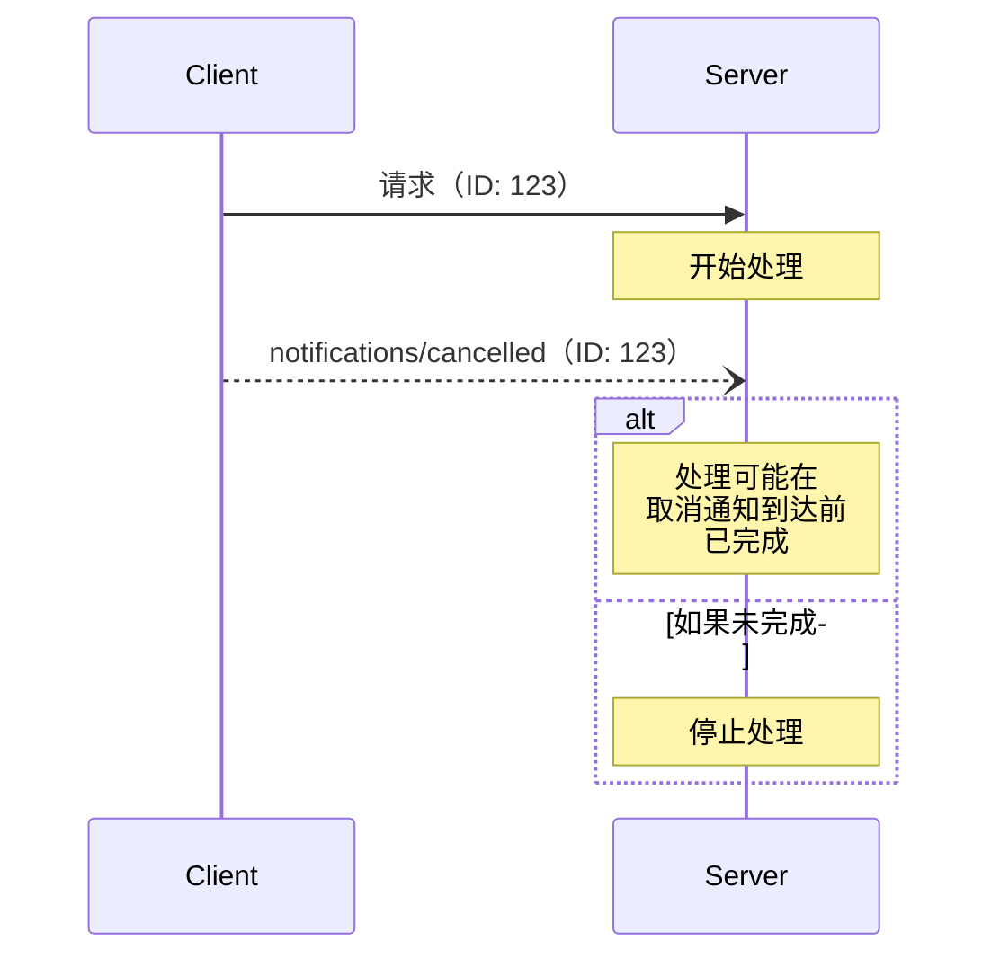

<Info>**协议修订版**：2025-03-26</Info>

模型上下文协议（MCP）通过通知消息支持对进行中请求的可选取消。任一方均可发送取消通知，以指示应终止先前发出的请求。

## 取消流程

当一方希望取消进行中的请求时，它会发送一个 `notifications/cancelled` 通知，包含：

- 要取消的请求的 ID
- 可选的原因字符串，可用于记录或显示

```json
{
  "jsonrpc": "2.0",
  "method": "notifications/cancelled",
  "params": {
    "requestId": "123",
    "reason": "用户请求取消"
  }
}
```

## 行为要求

1. 取消通知 **必须** 仅引用满足以下条件的请求：
   - 之前在同一方向上发出的请求
   - 被认为仍在进行中的请求
2. `initialize` 请求 **不得** 被客户端取消
3. 收到取消通知的一方 **应该**：
   - 停止处理被取消的请求
   - 释放相关资源
   - 不为被取消的请求发送响应
4. 收到取消通知的一方 **可以** 忽略取消通知，如果：
   - 引用的请求未知
   - 处理已完成
   - 请求无法取消
5. 发送取消通知的一方 **应该** 忽略随后到达的该请求的任何响应

## 时间考虑

由于网络延迟，取消通知可能在请求处理完成后到达，甚至在响应已发送之后到达。

双方 **必须** 优雅地处理这些竞争条件：



## 实现注意事项

- 双方 **应该** 记录取消原因以便调试
- 应用程序用户界面 **应该** 在请求取消时进行提示

## 错误处理

无效的取消通知 **应该** 被忽略：

- 未知的请求 ID
- 已完成的请求
- 格式错误的通知

这保持了通知的“发送即忘”特性，同时允许异步通信中的竞争条件。