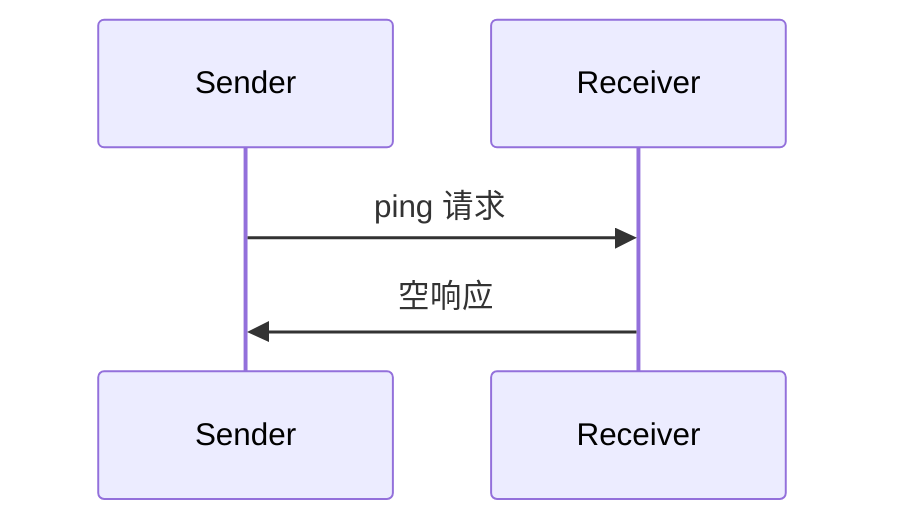

<Info>**协议修订版**：2025-03-26</Info>

模型上下文协议（MCP）包含一个可选的 ping 机制，允许任一方验证其对端是否仍然响应以及连接是否存活。

## 概述

ping 功能通过简单的请求/响应模式实现。客户端或服务器可以通过发送 `ping` 请求来启动 ping。

## 消息格式

ping 请求是一个标准的 JSON-RPC 请求，不带任何参数：

```json
{
  "jsonrpc": "2.0",
  "id": "123",
  "method": "ping"
}
```

## 行为要求

1. 接收方 **必须** 迅速响应一个空响应：

```json
{
  "jsonrpc": "2.0",
  "id": "123",
  "result": {}
}
```

2. 如果在合理超时时间内未收到响应，发送方 **可以**：
   - 认为连接已失效
   - 终止连接
   - 尝试重新连接流程

## 使用模式



## 实现注意事项

- 实现 **应该** 定期发出 ping 以检测连接健康状况
- ping 的频率 **应该** 是可配置的
- 超时时间 **应该** 适合网络环境
- 应避免过度 ping 以减少网络开销

## 错误处理

- 超时 **应该** 被视为连接失败
- 多次 ping 失败 **可以** 触发连接重置
- 实现 **应该** 记录 ping 失败以便诊断