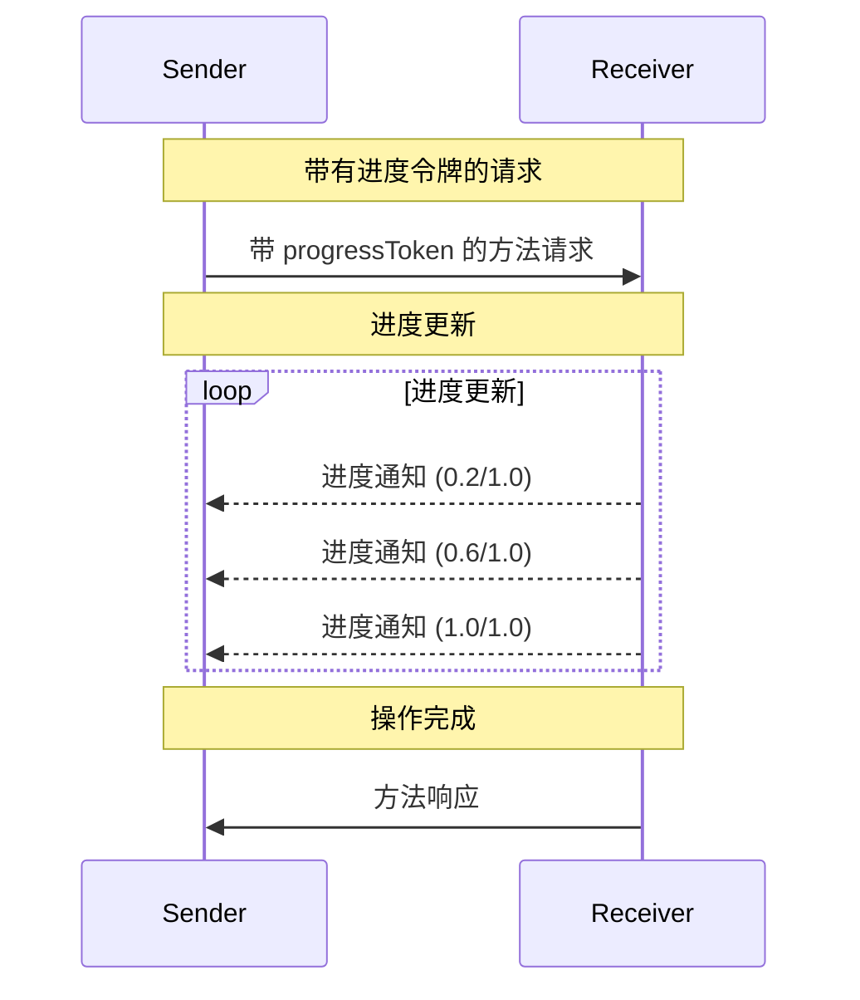

<Info>**协议修订版**：2025-03-26</Info>

模型上下文协议（MCP）通过通知消息支持对长时间运行操作的可选进度跟踪。任一方均可发送进度通知，以提供操作状态的更新。

## 进度流程

当一方希望 _接收_ 请求的进度更新时，它会在请求元数据中包含一个 `progressToken`。

- 进度令牌 **必须** 是字符串或整数值
- 进度令牌可由发送方以任意方式选择，但 **必须** 在所有活动请求中唯一。

```json
{
  "jsonrpc": "2.0",
  "id": 1,
  "method": "some_method",
  "params": {
    "_meta": {
      "progressToken": "abc123"
    }
  }
}
```

接收方 **可以** 随后发送包含以下内容的进度通知：

- 原始进度令牌
- 当前的进度值
- 可选的“总计”值
- 可选的“消息”值

```json
{
  "jsonrpc": "2.0",
  "method": "notifications/progress",
  "params": {
    "progressToken": "abc123",
    "progress": 50,
    "total": 100,
    "message": "正在处理数据..."
  }
}
```

- `progress` 值 **必须** 在每次通知中增加，即使总计未知。
- `progress` 和 `total` 值 **可以** 是浮点数。
- `message` 字段 **应该** 提供相关的可读进度信息。

## 行为要求

1. 进度通知 **必须** 仅引用满足以下条件的令牌：
   - 在活动请求中提供的令牌
   - 与进行中的操作相关联的令牌

2. 收到进度请求的一方 **可以**：
   - 选择不发送任何进度通知
   - 以其认为适当的频率发送通知
   - 如果总计未知，则省略总计值



## 实现注意事项

- 发送方和接收方 **应该** 跟踪活动的进度令牌
- 双方 **应该** 实现速率限制以防止消息泛洪
- 进度通知在操作完成后 **必须** 停止
