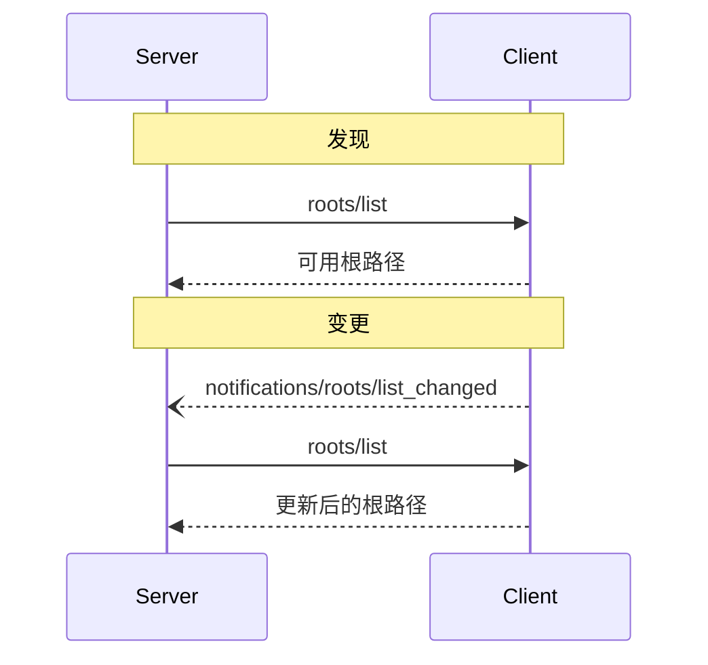

<Info>**协议修订版**：2025-03-26</Info>

模型上下文协议（MCP）为客户端提供了一种标准化的方式，向服务器暴露文件系统的“根路径”。根路径定义了服务器在文件系统中可以操作的边界，使服务器能够了解其有权访问的目录和文件。服务器可以从支持根路径的客户端请求根路径列表，并在该列表发生变化时接收通知。

## 用户交互模型

在 MCP 中，根路径通常通过工作空间或项目配置界面暴露。

例如，实现可以提供一个工作空间/项目选择器，允许用户选择服务器应有权访问的目录和文件。这可以与来自版本控制系统或项目文件的自动工作空间检测结合使用。

然而，实现可以自由选择适合其需求的任何界面模式来暴露根路径——协议本身不强制要求特定的用户交互模型。

## 能力

支持根路径的客户端 **必须** 在 [初始化](/specification/2025-03-26/basic/lifecycle#initialization) 期间声明 `roots` 能力：

```json
{
  "capabilities": {
    "roots": {
      "listChanged": true
    }
  }
}
```

`listChanged` 指示客户端是否会在根路径列表发生变化时发出通知。

## 协议消息

### 列出根路径

要获取根路径，服务器发送 `roots/list` 请求：

**请求：**

```json
{
  "jsonrpc": "2.0",
  "id": 1,
  "method": "roots/list"
}
```

**响应：**

```json
{
  "jsonrpc": "2.0",
  "id": 1,
  "result": {
    "roots": [
      {
        "uri": "file:///home/user/projects/myproject",
        "name": "我的项目"
      }
    ]
  }
}
```

### 根路径列表变更

当根路径发生变化时，支持 `listChanged` 的客户端 **必须** 发送通知：

```json
{
  "jsonrpc": "2.0",
  "method": "notifications/roots/list_changed"
}
```

## 消息流程



## 数据类型

### 根路径

根路径定义包括：

- `uri`：根路径的唯一标识符。在当前规范中，这 **必须** 是 `file://` URI。
- `name`：可选的用于显示的人类可读名称。

不同用例的根路径示例：

#### 项目目录

```json
{
  "uri": "file:///home/user/projects/myproject",
  "name": "我的项目"
}
```

#### 多个仓库

```json
[
  {
    "uri": "file:///home/user/repos/frontend",
    "name": "前端仓库"
  },
  {
    "uri": "file:///home/user/repos/backend",
    "name": "后端仓库"
  }
]
```

## 错误处理

客户端 **应该** 为常见失败情况返回标准的 JSON-RPC 错误：

- 客户端不支持根路径：`-32601`（方法未找到）
- 内部错误：`-32603`

错误示例：

```json
{
  "jsonrpc": "2.0",
  "id": 1,
  "error": {
    "code": -32601,
    "message": "不支持根路径",
    "data": {
      "reason": "客户端不具备根路径能力"
    }
  }
}
```

## 安全考虑

1. 客户端 **必须**：

   - 仅暴露具有适当权限的根路径
   - 验证所有根路径 URI 以防止路径穿越
   - 实现适当的访问控制
   - 监控根路径的可访问性

2. 服务器 **应该**：
   - 处理根路径变得不可用的情况
   - 在操作期间遵守根路径边界
   - 针对提供的根路径验证所有路径

## 实现指南

1. 客户端 **应该**：

   - 在向服务器暴露根路径之前提示用户同意
   - 提供清晰的根路径管理用户界面
   - 在暴露之前验证根路径的可访问性
   - 监控根路径的变化

2. 服务器 **应该**：
   - 在使用前检查根路径能力
   - 优雅地处理根路径列表的变更
   - 在操作中遵守根路径边界
   - 适当缓存根路径信息
