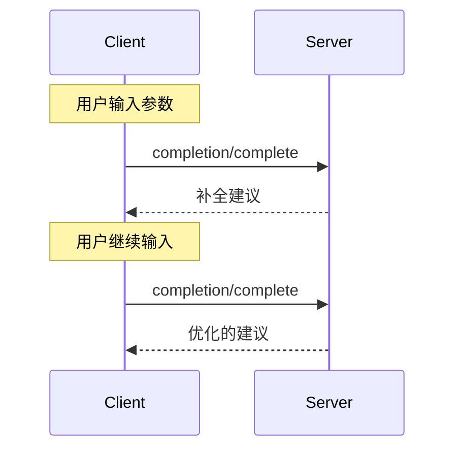

<Info>**协议修订版**：2025-03-26</Info>

模型上下文协议（MCP）为服务器提供了一种标准化的方式，为提示和资源 URI 提供参数自动补全建议。这使得用户在输入参数值时能够获得类似 IDE 的丰富上下文建议体验。

## 用户交互模型

MCP 中的自动补全设计旨在支持类似于 IDE 代码补全的交互式用户体验。

例如，应用程序可以在用户输入时通过下拉菜单或弹出窗口显示补全建议，并支持过滤和选择可用选项。

然而，实现可以自由选择适合其需求的任何界面模式来暴露自动补全功能——协议本身不强制要求特定的用户交互模型。

## 能力

支持自动补全的服务器 **必须** 声明 `completions` 能力：

```json
{
  "capabilities": {
    "completions": {}
  }
}
```

## 协议消息

### 请求补全

要获取补全建议，客户端发送 `completion/complete` 请求，通过引用类型指定正在补全的内容：

**请求：**

```json
{
  "jsonrpc": "2.0",
  "id": 1,
  "method": "completion/complete",
  "params": {
    "ref": {
      "type": "ref/prompt",
      "name": "code_review"
    },
    "argument": {
      "name": "language",
      "value": "py"
    }
  }
}
```

**响应：**

```json
{
  "jsonrpc": "2.0",
  "id": 1,
  "result": {
    "completion": {
      "values": ["python", "pytorch", "pyside"],
      "total": 10,
      "hasMore": true
    }
  }
}
```

### 引用类型

协议支持两种补全引用类型：

| 类型           | 描述                     | 示例                                                 |
| -------------- | ------------------------ | ---------------------------------------------------- |
| `ref/prompt`   | 按名称引用提示           | `{"type": "ref/prompt", "name": "code_review"}`      |
| `ref/resource` | 引用资源 URI             | `{"type": "ref/resource", "uri": "file:///{path}"}`  |

### 补全结果

服务器返回按相关性排序的补全值数组，包含：

- 每次响应最多 100 个项目
- 可选的可用匹配总数
- 指示是否存在额外结果的布尔值

## 消息流程



## 数据类型

### CompleteRequest

- `ref`：`PromptReference` 或 `ResourceReference`
- `argument`：包含以下内容的对象：
  - `name`：参数名称
  - `value`：当前值

### CompleteResult

- `completion`：包含以下内容的对象：
  - `values`：建议数组（最多 100 个）
  - `total`：可选的匹配总数
  - `hasMore`：额外结果标志

## 错误处理

服务器 **应该** 为常见失败情况返回标准的 JSON-RPC 错误：

- 方法未找到：`-32601`（能力不支持）
- 无效提示名称：`-32602`（无效参数）
- 缺少必需参数：`-32602`（无效参数）
- 内部错误：`-32603`（内部错误）

## 实现注意事项

1. 服务器 **应该**：

   - 返回按相关性排序的建议
   - 在适当情况下实现模糊匹配
   - 对补全请求进行速率限制
   - 验证所有输入

2. 客户端 **应该**：
   - 对快速补全请求进行防抖处理
   - 在适当情况下缓存补全结果
   - 优雅地处理缺失或部分结果

## 安全

实现 **必须**：

- 验证所有补全输入
- 实现适当的速率限制
- 控制对敏感建议的访问
- 防止基于补全的信息泄露
